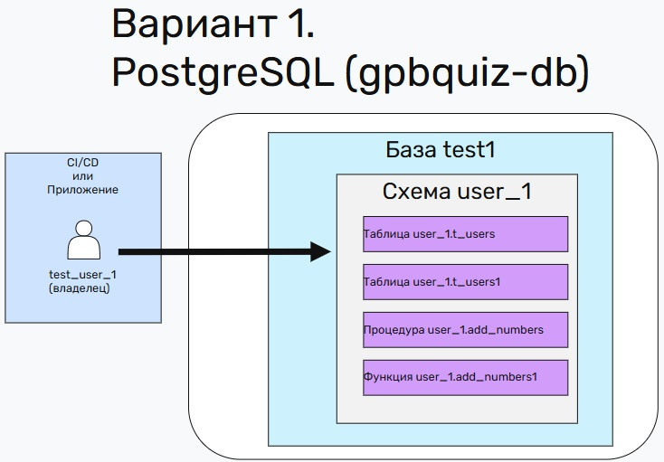
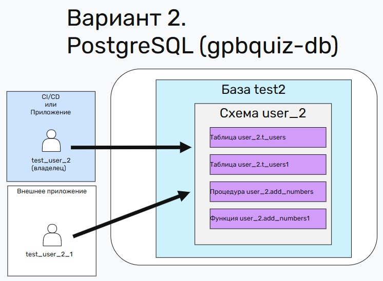
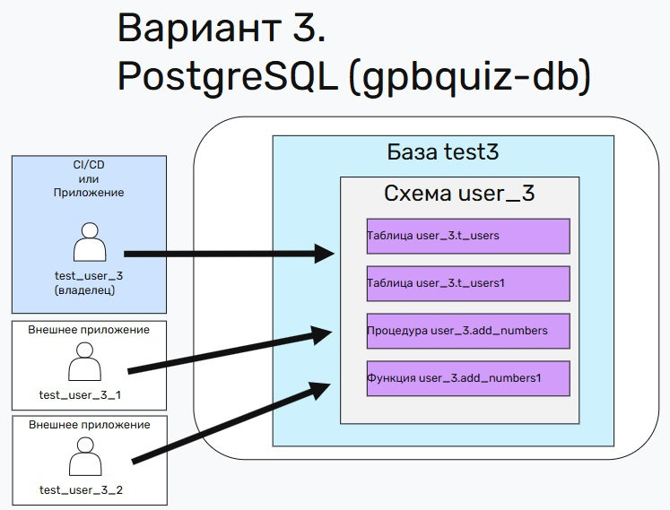
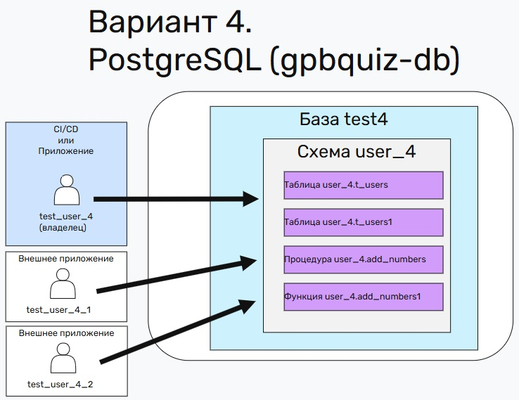

# Пользователи и права PostgreSQL

## 1. Какие бывают типы пользователей?

1. Роли - не подключаются к БД
2. Пользователи или технические учётные записи (ТУЗ) - подключаются к БД

Подробнее в этом уроке:
https://edu.postgrespro.ru/16/dba1-16/dba1_13_access_overview.html

## 2. Варианты работы с БД PostgreSQL

Как мы можем работать с БД PostgreSQL

## 2.1. Вариант 1 - одна ТУЗ (test_user_1)

<p></p>

Всего одна ТУЗ (test_user_1) - катим и обновляем, а также подключаемся под ней.

Выдача прав - в данной схеме не происходит, поскольку один ТУЗ для всего.

**Чем плохо**: если это микросервис, то ОК, но если баз много и они создаются из под одной ТУЗ, то могут быть проблемы с сопровождением, быстрой идентификацией проблем.

**Чем удобно**: учётка одна и есть соответствующие проблемы

[Скрипт](script-1.sql)

## 2.2. Вариант 2 - одна ТУЗ владелец (test_user_2) + одна внешняя ТУЗ для работы с БД (test_user_2_1) + явная выдача прав

<p></p>

Одна ТУЗ (test_user_2) - катим и обновляем, а также подключаемся под ней.
Есть дополнительная ТУЗ (test_user_2_1) - она работает с объектами БД.

Выдача прав
```
GRANT USAGE, CREATE ON SCHEMA user_2 TO test_user_2_1;
GRANT SELECT ON user_2.t_users TO test_user_2_1;
GRANT SELECT ON user_2.t_users1 TO test_user_2_1;
GRANT EXECUTE ON PROCEDURE user_2.add_numbers(INT, INT, INT) TO test_user_2_1; --REVOKE EXECUTE ON PROCEDURE user_2.add_numbers(INT, INT, INT) FROM test_user_2_1;
GRANT EXECUTE ON FUNCTION user_2.add_numbers1(INT, INT) TO test_user_2_1; --REVOKE EXECUTE ON FUNCTION user_2.add_numbers1(INT, INT) FROM test_user_2_1;
GRANT SELECT, UPDATE ON ALL SEQUENCES IN SCHEMA user_2 TO test_user_2_1; --это нужно делать ДО 16 PostgreSQL, иначе если у вас есть sequence, то не вставите в такую таблицу пользователем test_user_2_1 
```

**Чем плохо**:

1. при добавлении новых объектов в схему user_2 надо явно добавлять права для test_user_2_1
2. если test_user_2_1 создаст объект в схеме user_2, то пользователь test_user_2 не сможет работать с этим объектом без явного добавления прав

**Чем удобно**: -

[Скрипт](script-2.sql)

## 2.3. Вариант 3 - одна ТУЗ владелец (test_user_3) + две внешние ТУЗ для работы с БД (test_user_3_1, test_user_3_2) + упрощённая выдача прав

<p></p>

Одна ТУЗ (test_user_3) - катим и обновляем, а также подключаемся под ней.
Есть дополнительная ТУЗ (test_user_3_1, test_user_3_2) - они работают с объектами БД.

Выдача прав
```
-- выдадим права массово на все таблицы схемы
GRANT SELECT, INSERT, UPDATE, DELETE ON ALL TABLES IN SCHEMA user_3 TO test_user_3_role; --REVOKE SELECT, INSERT, UPDATE, DELETE ON ALL TABLES IN SCHEMA user_3 FROM test_user_3_role;
-- выдадим права массово на все процедуры и функции схемы
GRANT EXECUTE ON ALL FUNCTIONS IN SCHEMA user_3 TO test_user_3_role; --REVOKE EXECUTE ON ALL FUNCTIONS IN SCHEMA user_3 FROM test_user_3_role;
GRANT SELECT, UPDATE ON ALL SEQUENCES IN SCHEMA user_3 TO test_user_3_1; --это нужно делать ДО 16 PostgreSQL, иначе если у вас есть sequence, то не вставите в такую таблицу пользователем test_user_2_1 
```

**Чем плохо**:

1. при добавлении новых объектов в схему user_3 надо явно добавлять права для test_user_3_1/2
2. если test_user_3_1/2 создаст объект в схеме user_3, то пользователь test_user_3 не сможет работать с этим объектом без явного добавления прав
3. добавляются права сразу на все объекты (это не всегда правильно)

**Чем удобно**:

1. добавление прав проще устроено, чем в Варианте 2

[Скрипт](script-3.sql)

## 2.4. Вариант 4 - одна ТУЗ владелец (test_user_4) + две внешние ТУЗ для работы с БД (test_user_4_1, test_user_4_2) + автоматическая выдача прав

<p></p>

Одна ТУЗ (test_user_4) - катим и обновляем, а также подключаемся под ней.
Есть дополнительная ТУЗ (test_user_4_1, test_user_4_2) - они работают с объектами БД.

Выдача прав
```
-- Даём права на чтение из ВСЕХ таблиц схемы user_4, которые будут созданы
ALTER DEFAULT PRIVILEGES IN SCHEMA user_4 GRANT SELECT, INSERT, UPDATE, DELETE ON TABLES TO test_user_4_role;
-- Даём права на выполнения для ВСЕХ новых функций и процедур, которые будут созданы в схеме
ALTER DEFAULT PRIVILEGES IN SCHEMA user_4 GRANT EXECUTE ON FUNCTIONS TO test_user_4_role;
-- Даём права на выполнения для ВСЕХ новых последовательностей, которые будут созданы в схеме (нужно только для версий младше PostgreSQL 16)
ALTER DEFAULT PRIVILEGES IN SCHEMA user_4 GRANT SELECT, UPDATE ON SEQUENCES TO test_user_4_role;
```

**Чем плохо**:

1. если test_user_4_1/2 создаст объект в схеме user_4, то пользователь test_user_4 не сможет работать с этим объектом без явного добавления прав
2. добавляются права сразу на все НОВЫЕ объекты (это не всегда правильно)
3. если схема применена на существующую БД, то надо для существующих объектов явно прописывать права

**Чем удобно**:

1. при добавлении новых объектов в схему user_4 НЕ надо явно добавлять права для test_user_4_1/2, всё происходит автоматически

[Скрипт](script-4.sql)

# 3. Анализ того, что мы увидели

# 3.1. Какую схему и когда выбирать

1. Если у вас микросервис - то лучше работать по Варианту 1, но есть минусы.
А именно - если понадобится доступ дополнительных пользователей, то придётся переходить к варианту 2 или 3

2. Если у вас база данных с большим числом объектов, которые часто добавляются - то оптимален Вариант 4

# 3.2. Интересные особенности

1. Для актуальных версий PostgreSQL понятия USER и ROLE являются синонимами

Следующие команды будут иметь одинаковый результат:
```
CREATE USER test_user_2_1 WITH PASSWORD 'test_user_2_1' LOGIN;
CREATE ROLE test_user_2_1 WITH PASSWORD 'test_user_2_1' LOGIN;
```

```
DROP USER test_user_2_1;
DROP ROLE test_user_2_1;
```

2. На примере Варианта 2. Если используете PostgreSQL до 16 версии, то надо ещё давать доступы к последовательностям.
В противном случае при вставке пользователя test_user_2_1 в таблицы схемы user_2 получите ошибку
```
GRANT SELECT, UPDATE ON ALL SEQUENCES IN SCHEMA user_2 TO test_user_2_1; --это нужно делать ДО 16 PostgreSQL, иначе если у вас есть sequence, то не вставите в такую таблицу пользователем test_user_2_1 
```

3. Особенности ALTER DEFAULT PRIVILEGES IN SCHEMA - EXECUTE

Команда ниже даёт права и на процедур и на функции!!!
```
ALTER DEFAULT PRIVILEGES IN SCHEMA user_4 GRANT EXECUTE ON FUNCTIONS TO test_user_4_role;
```

3. Особенности ALTER DEFAULT PRIVILEGES IN SCHEMA - на существующие объекты

Если вы применили ALTER DEFAULT PRIVILEGES IN SCHEMA после создания БД и объектов, то вам необходимо явно выдать права на ВСЕ объекты, созданные ДО запуска команды ALTER DEFAULT PRIVILEGES IN SCHEMA

